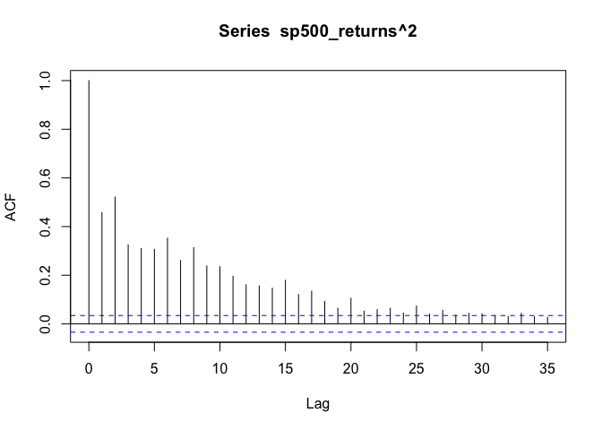

ARIMA-GARCH
================
Ryan Moerer

2022-12-31

## ARIMA

An ARIMA model of order ($p, d, q$) can be formulated as

$$
x_t^\prime = \phi_1x^\prime_{t-1} + \cdots+\phi_px^\prime_{t-p}+\theta_1w_{t-1}+\cdots+\theta_qw_{t-q}+w_t
$$

where $x^\prime_{t}$ is a time series differenced $d$ times and is
assumed to be stationary (constant mean and constant variance). ARIMA
models can be written much more succinctly using the backshift operator

$$
\phi_p(\textbf{B})(1-\textbf{B})^dx_t=\theta_q(\textbf{B})w_t
$$

## ARIMA-GARCH

In many areas, most notably finance, the constant variance that we
assume with a stationary time series is violated. Thus, approaches are
needed to model the conditional heteroskedasticity of these types of
time series. One popular approach to this problem is the GARCH model.
GARCH($p, q$) can easily be combined with ARIMA($p, d, q$) in the
following way

${x_t}$ is an ARIMA($p, d, q$) process, except $w_t$ is not assumed to
constant Gaussian white noise but rather

$w_t = \sigma_t\epsilon_t$

and

$\sigma^2_t = \alpha_0 + \alpha_1w^2_{t-1} + \cdots+\alpha_pw^2_{t-p}+\beta_1\sigma^2_{t-1}+ \cdots + \beta_q\sigma^2_{t-q}$

## Fitting an ARIMA-GARCH model

We will use the `rugarch` package to fit a simple ARIMA-GARCH model on
the log returns (first difference of the log of price) of the S&P500
Index. We will consider data going back to 2010.

### Compute log returns

``` r
library(quantmod)
library(rugarch)

# get S&P500 Index
sp500 <- getSymbols("^GSPC",
           from = "2010-01-01",
           to = "2022-12-31",
           auto.assign = F)
# extract close
sp500 <- Cl(sp500)

# plot S&P 500 Index
plot(sp500)
```

<!-- -->

``` r
# compute log returns
sp500_returns <- diff(log(sp500)) |> na.omit()

# plot S&P 500 log returns
plot(sp500_returns)
```

<!-- -->

### ACF and PACF of returns and returns^2

Taking a look at the ACF and PACF for the log returns, there appears to
be a light dependence between previous values. However, in looking at
the square of the returns it is clear that there is a strong dependence
between current volatility and previous volatility.

``` r
acf(sp500_returns)
```

<!-- -->

``` r
pacf(sp500_returns)
```

<!-- -->

``` r
acf(sp500_returns^2)
```

<!-- -->

### Model Selection

We will select a model in a stepwise fashion in which we iterate through
a set of possible ($p,q$) orders for the ARMA aspect of the model and
fit each ARMA part with a GARCH(1, 1) part. We will also used a skewed
generalized error distribution for the errors because normally
distributed conditional errors is often a poor assumption for financial
time series. The best model will be selected by Bayesian Information
Criterion.

``` r
final_bic <- Inf; final_model <- NULL; final_order <- NULL
for (i in 0:5) for (j in 0:5) {
  spec <- ugarchspec(
    mean.model = list(armaOrder = c(i, j), include.mean = T),
    variance.model = list(model = "sGARCH", garchOrder = c(1, 1)),
    distribution.model = "sged"
  )
  fit <- ugarchfit(spec, data = sp500_returns, solver = "hybrid")
  fit_bic <- infocriteria(fit)[2]
  if (fit_bic < final_bic) {
    final_bic <- fit_bic
    final_model <- fit
    final_order <- c(i, j)
  }
}
```

### Final Model Fit

``` r
final_model@fit$matcoef
```

    ##             Estimate   Std. Error    t value     Pr(>|t|)
    ## mu      6.472194e-04 8.588745e-05   7.535669 4.862777e-14
    ## ar1     7.925026e-01 5.380157e-02  14.730102 0.000000e+00
    ## ma1    -8.614579e-01 4.454315e-02 -19.339850 0.000000e+00
    ## omega   2.257210e-06 1.240841e-06   1.819097 6.889664e-02
    ## alpha1  1.529333e-01 2.119894e-02   7.214199 5.424550e-13
    ## beta1   8.298653e-01 2.169075e-02  38.258949 0.000000e+00
    ## skew    8.486868e-01 2.368601e-02  35.830722 0.000000e+00
    ## shape   1.335117e+00 4.748356e-02  28.117449 0.000000e+00

``` r
par(mfrow=c(2,2))
plot(final_model, which=1)
plot(final_model, which=3)
plot(final_model, which=8)
plot(final_model, which=9)
```


``` r
par(mfrow=c(1,2))
plot(final_model, which=10)
plot(final_model, which=11)
```


## Where to go from here

The fitted model above is a simple example of fitting an ARIMA-GARCH
model. There are of course a variety of ways to improve upon this model.
For one, there are numerous variations on simple GARCH models (EGARCH,
IGARCH, etc.) that can better account for specific oddities that we
often see in financial time series. Also, in researching ARIMA-GARCH
models, practitioners often vary the fitting window in order to better
account for the changing dynamics in financial time series.
