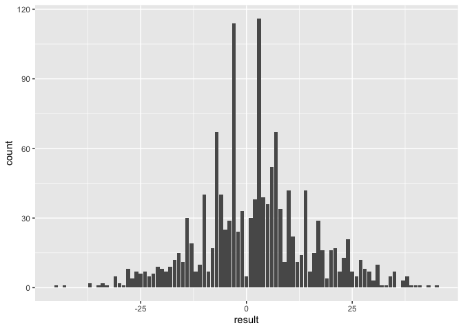
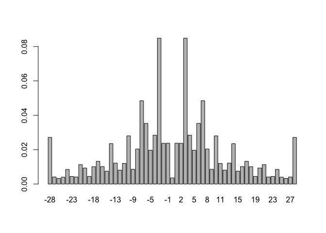

Deriving scoring margin distribution from moneyline
================
Ryan Moerer

2022-12-20

## The Problem at Hand

The distribution of scoring margins in the NFL is quite wonky. While
somewhat symmetrical around the spread, the distribution is certainly
not smooth due to the key numbers (like 3, 7, etc.) that pop up much
more often than many of the common probability distributions would
imply. Therefore,

## The Data

We will be focusing on the NFL specifically and more specifically we
will be focusing on games/point spreads from 2006 onward.

``` r
library(bettools) # personal package for some basic betting functions
library(tidyverse)

# load NFL schedules and only include games where there is a moneyline
data <- nflreadr::load_schedules()
data <- data %>% filter(!is.na(home_moneyline) & !is.na(result))
# create analysis dataframe
data <- rbind(
  data %>%
    select(game_id,
           team = home_team, 
           opp = away_team,
           team_spread = spread_line,
           team_spread_odds = home_spread_odds,
           opp_spread_odds = away_spread_odds,
           team_moneyline = home_moneyline,
           opp_moneyline = away_moneyline,
           result) %>%
    mutate(team_spread = -team_spread),
  data %>%
    select(game_id,
           team = away_team, 
           opp = home_team,
           team_spread = spread_line,
           team_spread_odds = away_spread_odds,
           opp_spread_odds = home_spread_odds,
           team_moneyline = away_moneyline,
           opp_moneyline = home_moneyline,
           result) %>%
    mutate(team_spread = team_spread,
           result = -result)
)
```

## A quick look at some data

In taking a quick look at the scoring margins for spreads between -2.5
and -3.5 we can see the problem previously described. Certain numbers
show up much more often than others.

``` r
data %>%
  filter(between(team_spread, -3.5, -2.5)) %>%
  ggplot(aes(x = result)) +
  geom_bar()
```

<!-- -->

## Ordinal Logistic Regression

Since we cannot use a smooth distribution we need some other approach.
The approach I will be exploring is taken from this
[article](https://www.inpredictable.com/2012/11/nfl-scoring-margin-distributions.html).
Essentially we will be using an ordered logistic regression to come up
with estimates for the scoring margin distribution. Rather than using
the spread in the regression, I will instead be converting the moneyline
to log odds and then use that as an offset in the model. I’m doing this
for two reasons primarily: 1) The moneyline is a continous value and
probably exists on a much smoother continuum than the spread 2) Many NFL
prediction models output a probability rather than a spread, so it would
be beneficial to have some sort of methodology for converting that
probability to a point spread.

``` r
data <- data %>%
  mutate(
    # prob of team winning implied from ml
    team_prob = remove_vig(team_moneyline, opp_moneyline),
    # convert implied prob to logit
    team_logit = logit(team_prob),
    # convert scoring margin to factor since that is what MASS::polr 
    # takes as a response
    result_fact = factor(pmin(28, pmax(-28, result)))
  )
```

``` r
# fit model
model <- MASS::polr(
  result_fact ~ offset(team_logit),
  data = data,
  Hess = T
)

# summarize model
summary(model)
```

    ## Call:
    ## MASS::polr(formula = result_fact ~ offset(team_logit), data = data, 
    ##     Hess = T)
    ## 
    ## No coefficients
    ## 
    ## Intercepts:
    ##         Value    Std. Error t value 
    ## -28|-27  -3.5795   0.0561   -63.8093
    ## -27|-26  -3.4353   0.0527   -65.1448
    ## -26|-25  -3.3331   0.0505   -65.9874
    ## -25|-24  -3.2194   0.0482   -66.8111
    ## -24|-23  -3.0114   0.0443   -67.9655
    ## -23|-22  -2.9172   0.0427   -68.3183
    ## -22|-21  -2.8365   0.0414   -68.5272
    ## -21|-20  -2.6390   0.0385   -68.6296
    ## -20|-19  -2.4983   0.0366   -68.3163
    ## -19|-18  -2.4367   0.0358   -68.0704
    ## -18|-17  -2.3075   0.0343   -67.3313
    ## -17|-16  -2.1565   0.0326   -66.0642
    ## -16|-15  -2.0517   0.0316   -64.9173
    ## -15|-14  -1.9794   0.0309   -63.9962
    ## -14|-13  -1.7753   0.0292   -60.7914
    ## -13|-12  -1.6804   0.0285   -58.9935
    ## -12|-11  -1.6204   0.0281   -57.7595
    ## -11|-10  -1.5358   0.0275   -55.8827
    ## -10|-9   -1.3543   0.0264   -51.3304
    ## -9|-8    -1.3026   0.0261   -49.9049
    ## -8|-7    -1.1854   0.0255   -46.4684
    ## -7|-6    -0.9319   0.0244   -38.1198
    ## -6|-5    -0.7637   0.0239   -31.9630
    ## -5|-4    -0.6744   0.0237   -28.5135
    ## -4|-3    -0.5496   0.0234   -23.5243
    ## -3|-2    -0.1975   0.0229    -8.6301
    ## -2|-1    -0.1021   0.0228    -4.4722
    ## -1|0     -0.0070   0.0228    -0.3085
    ## 0|1       0.0072   0.0228     0.3152
    ## 1|2       0.1022   0.0228     4.4786
    ## 2|3       0.1976   0.0229     8.6368
    ## 3|4       0.5498   0.0234    23.5302
    ## 4|5       0.6745   0.0237    28.5189
    ## 5|6       0.7639   0.0239    31.9681
    ## 6|7       0.9320   0.0244    38.1244
    ## 7|8       1.1855   0.0255    46.4723
    ## 8|9       1.3027   0.0261    49.9085
    ## 9|10      1.3544   0.0264    51.3340
    ## 10|11     1.5359   0.0275    55.8852
    ## 11|12     1.6205   0.0281    57.7617
    ## 12|13     1.6804   0.0285    58.9951
    ## 13|14     1.7754   0.0292    60.7927
    ## 14|15     1.9794   0.0309    63.9957
    ## 15|16     2.0517   0.0316    64.9167
    ## 16|17     2.1565   0.0326    66.0637
    ## 17|18     2.3075   0.0343    67.3299
    ## 18|19     2.4367   0.0358    68.0680
    ## 19|20     2.4983   0.0366    68.3137
    ## 20|21     2.6390   0.0385    68.6264
    ## 21|22     2.8365   0.0414    68.5228
    ## 22|23     2.9172   0.0427    68.3132
    ## 23|24     3.0115   0.0443    67.9597
    ## 24|25     3.2198   0.0482    66.8032
    ## 25|26     3.3337   0.0505    65.9783
    ## 26|27     3.4365   0.0528    65.1316
    ## 27|28     3.5803   0.0561    63.8010
    ## 
    ## Residual Deviance: 63961.53 
    ## AIC: 64073.53

``` r
# plot estimated distribution for an even moneyline
# (for whatever reason predict does not allow for offsets for a polr object 
# despite being able to fit the model with one)
barplot(predict(model, newdata = data.frame(team_logit = 0), type="probs"))
```

<!-- -->

Lines up relatively well with what we saw from what we might assume. We
can certainly see the key numbers (3, 7, 10, etc.) having much more
prominence than

## Some useful applications

### Get scoring margin distribution from moneyline

First and foremost it would be beneficial to compute the scoring margin
distribution from the moneyline for a game. For some odd reason, `polr`
seems to be able to fit a model with an offset, but `predict.polr` does
not consider offsets. Thus, we need to create the function manually.

``` r
probs_from_moneyline <- function(model, moneyline, type="us") {
  implied_logit <- logit(implied_prob(moneyline, type))
  zeta <- model$zeta
  cum_logits <- zeta - implied_logit
  cum_probs <- invlogit(cum_logits)
  probs <- c(
    cum_probs[1],
    diff(cum_probs),
    1 - cum_probs[length(cum_probs)]
  )
  names(probs) <- -28:28
  probs
}

barplot(probs_from_moneyline(model, 100))
```

<!-- -->

### Compute spread from moneyline

Now that we have the scoring margin probabilities, we can compute the
spread from the moneyline.

``` r
# TODO: Might want to come up with a more vectorized approach
compute_spread <- function(model, moneyline, type="us") {
  # possible point values
  vals <- -28:28
  probs <- probs_from_moneyline(model, moneyline, type="us")
  names(probs) <- vals
  spreads <- seq(-27.5, 27.5, 0.5)
  spread_probs <- numeric(length(spreads))
  for (i in 1:length(spreads)) {
    # if spread is a whole number we need to compute prob of covering
    # conditional on not landing on said number (since that would be a push)
    if (spreads[i] %% 1 == 0) {
      spread_probs[i] <-
        sum(probs[which(vals < spreads[i])]) / (1 - probs[which(vals == spreads[i])])
    } else {
      spread_probs[i] <- sum(probs[which(vals < spreads[i])])
    }
  }
  spread_ind <- which.min(abs(spread_probs - 0.5))
  # return list of spread and spread prob
  list(
    spread = -spreads[spread_ind],
    prob = 1 - spread_probs[spread_ind]
  )
}

compute_spread(model, -210)
```

    ## $spread
    ## [1] -5.5
    ## 
    ## $prob
    ## [1] 0.4945166

## Limitations and things to improve on

This was ultimately a simple attempt to get more comfortable with an
ordered logistic regression in an applied setting and while we seemed to
get results that made sense, there are certainly quite a few
limitations/things to improve on.

-   A major change was made in extra points scoring in recent years so
    older seasons might not be representative of current scoring margin
    distributions.
-   Other factors, such as the point total for a game or team variance
    could impact the spread of the scoring margin distribution.
-   The assumptions needed for an ordered logistic regression might be
    violated.
